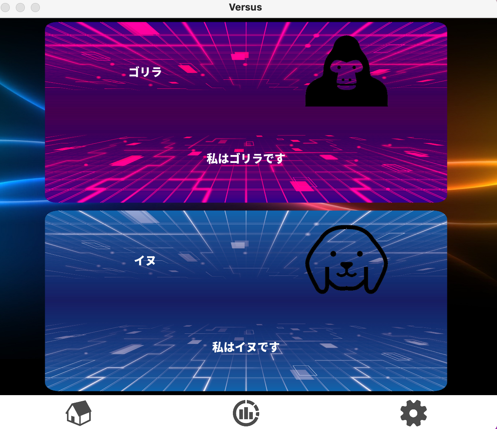
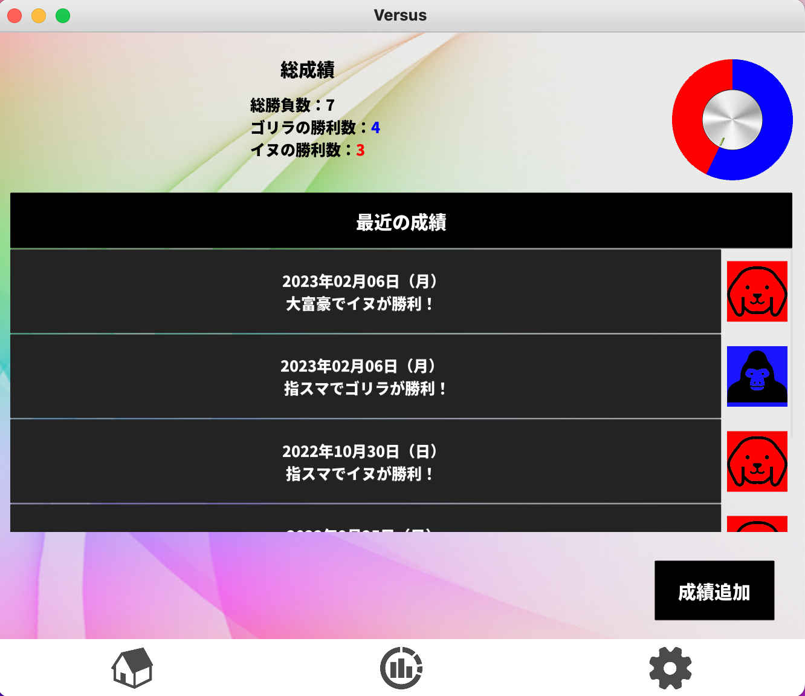
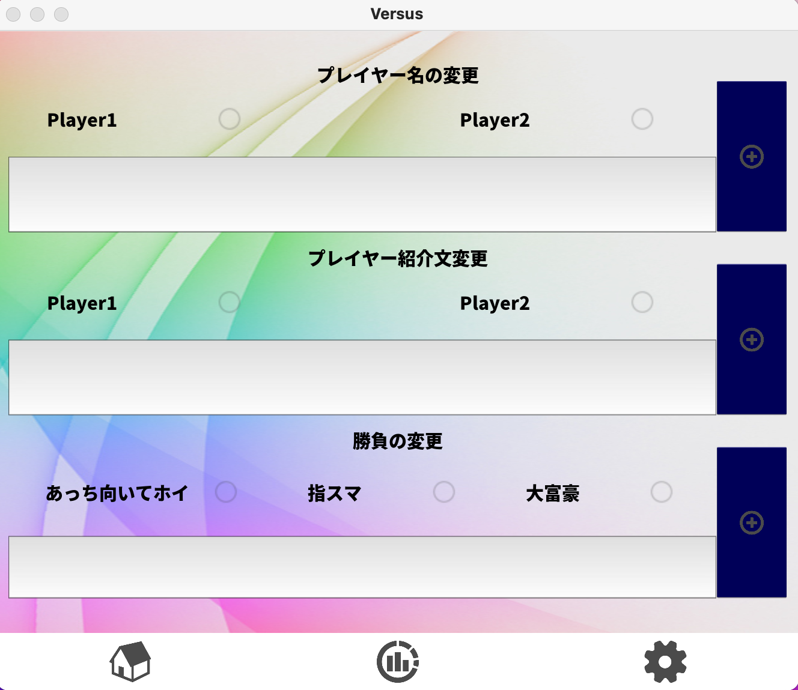
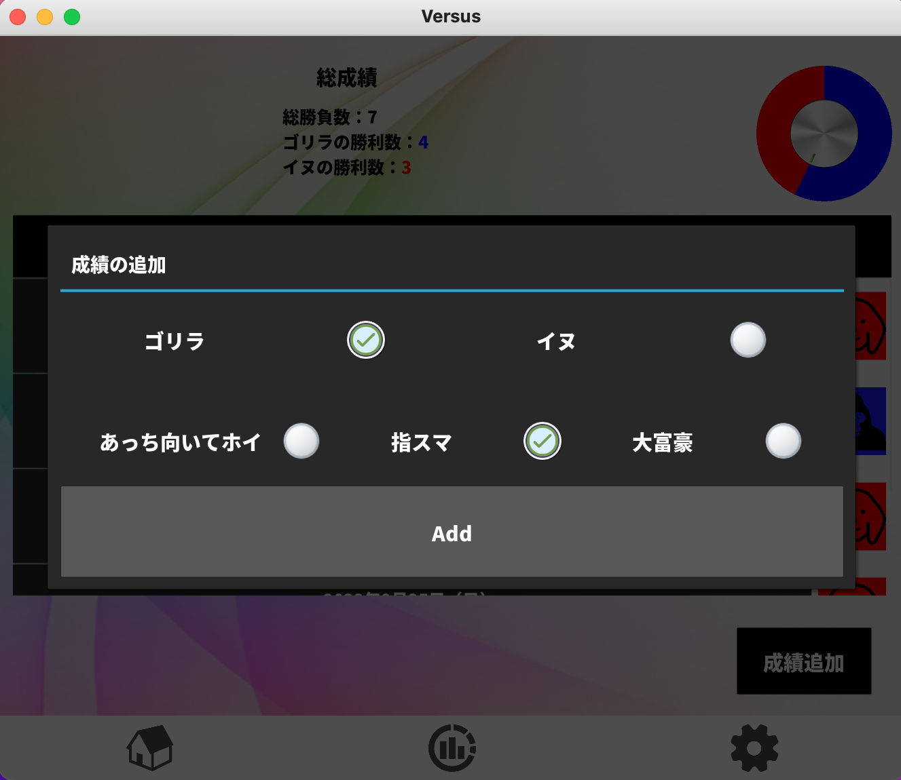

# versus_app
## Overview
This is an application to record your daily game with your girlfriend or best friend.\
The application consists of three screens: Home(Image1), Records(Image2), and Settings(Image3).




## Details
### Home
The home screen contains cards with the names, images, and introductions of the two people.\
Names, images, and introductions can be changed in the application.\
The pattern of the card can also be changed by modifying the source code.\
```
# vs.kv (line 95, and 123)
# Can be changed to any image
source: "vs_card1.png"
```

### Records
The records screen displays the five most recent win records and the overall results.\
The overall results are updated and the meter changes accordingly.\
You can also add your own scores.\
Note : Once a record is added, it cannot be deleted.\


### Settings
The settings screen allows players to change their names, introductions, and types of matches.\
The changes are reflected at the next startup.\

## Method used
After downloading(git clone ~), the application is started by executing file main.py.
```
python main.py
```
Note: It will not work without kivy installed.
